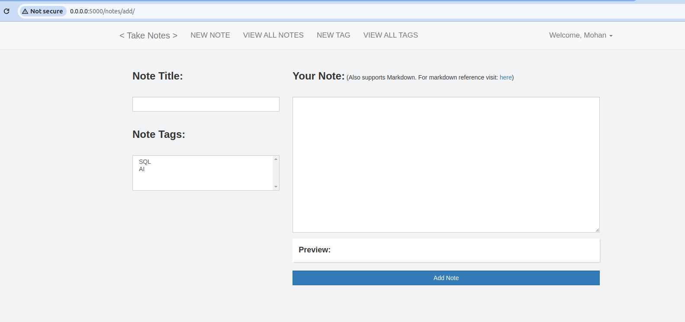
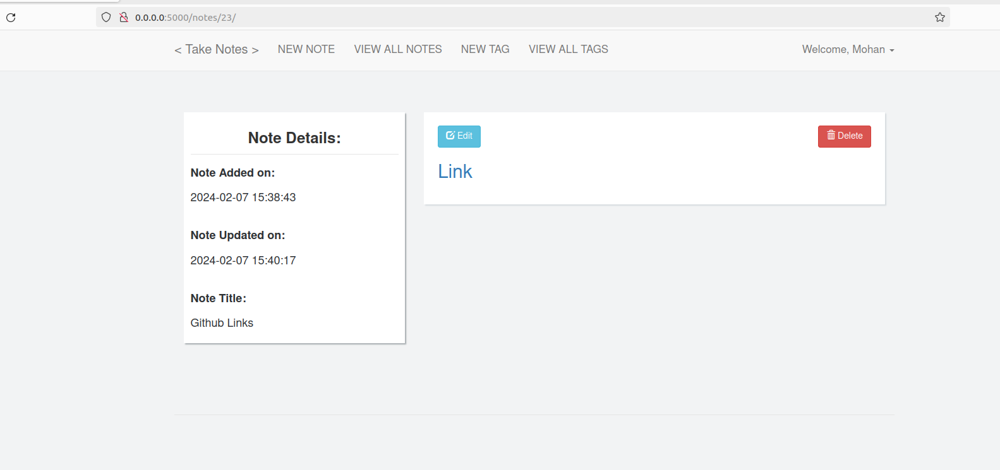
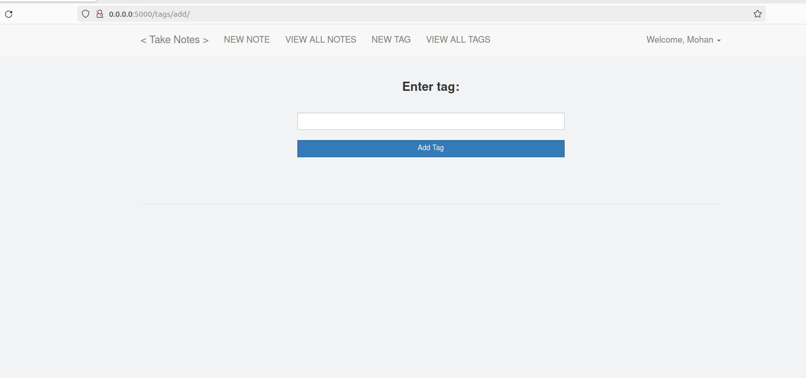
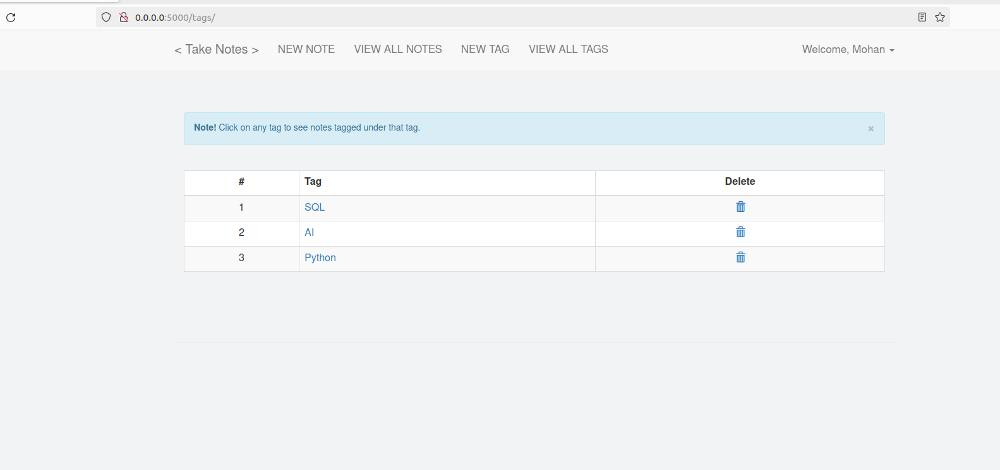
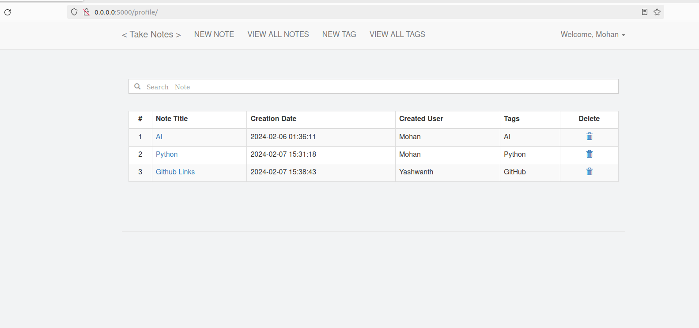
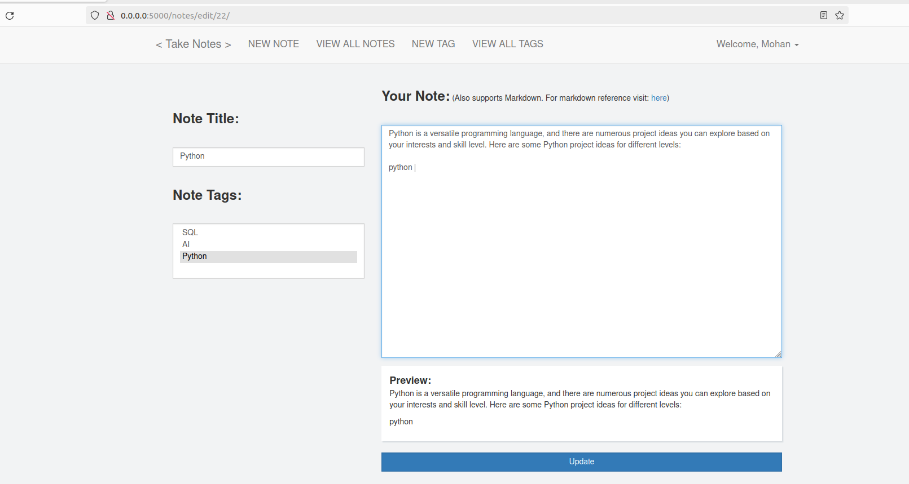

# A-Simple-Note-Taking-Web-App
An easy to use and deploy web app built using Flask
# Features:

* Simple Web application, easy to use and *very* easy to deploy locally
* Support for SQLite, so you can easily play with it
* REST API for retrieving data easily

# Requirements:

Execute the following command to install the required third party libraries:(use python3.9) 

`pip3 install -r requirements.txt`

# Usage:

Create virtual environment for python3.9

`python3.9 -m venv myenv`

Activate virtual environment

`source myenv/bin/activate`

Install the dependencies by simply executing:

`pip3 install -r requirements.txt`

Run this command to start the app:

`python3 manage.py`

Visit `0.0.0.0:5000` on your web browser

# Results

## Creating a new note
Simple interface with live preview and markdown support

## Viewing a note
Edit box provided to simply edit the note

## Adding a tag

## Viewing all tags
You can click on any tag to see all notes tagged under *that* tag

## Shared Note
You can see multiple users created notes

# Edit Note
You can edit notes created by others 

